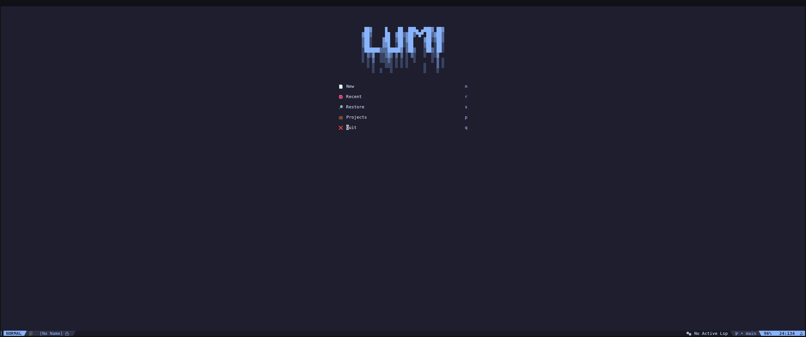
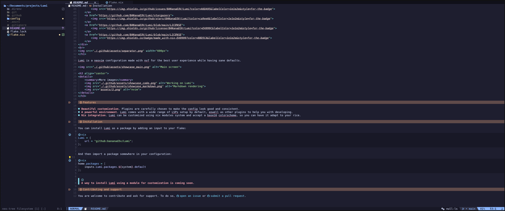
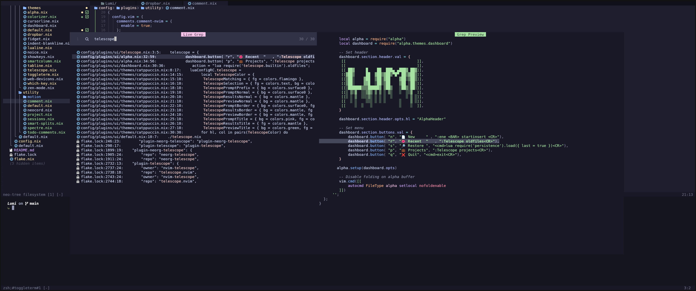

<h1 align="center">
A neovim config made with <a href="https://github.com/NotAShelf/nvf">nvf</a>
<br>

<br>

<div align="center">
    <p></p>
    <a href="https://github.com/BANanaD3V/Lumi/issues">
        
    </a>
    <a href="https://github.com/BANanaD3V/Lumi/stargazers">
        
    </a>
    <a href="https://github.com/BANanaD3V/Lumi/blob/main/LICENSE">
        
    </a>
    <a href="https://github.com/BANanaD3V/Lumi/blob/main/LICENSE">
        
    </a>
    <br>
</div>
</h1>

Lumi is a neovim configuration made with nvf for the best user experience while
having sane defaults.



<h3 align="center">
<details>
    <summary>More images</summary>
    
    
    
</details>
</h3>

## Features

- **Beautiful customization**. Plugins are carefully chosen to make the config
  look good and consistent.
- **A powerful environment**. Lumi comes with a wide range of LSPs setup by
  default, aswell as other plugins to help you with developing.
- **Nix integration**. Lumi can be customized using nix modules system and
  accept a base16 colorscheme, so you can have it adapt to your rice.

## Installation

You can install Lumi as a package by adding an input to your flake:

```nix
Lumi = {
    url = "github:bananad3v/Lumi";
};
```

And then import a package somewhere in your configuration:

```nix
home.packages = [
    inputs.Lumi.packages.${system}.default
];
```

> [!NOTE]\
> A way to install Lumi using a module for customization is coming soon.

## Contributing and support

You are welcome to contribute and ask for support. To do so,
[open an issue](https://github.com/BANanaD3V/Lumi/issues) or
[submit a pull request](https://github.com/BANanaD3V/Lumi/pulls).
